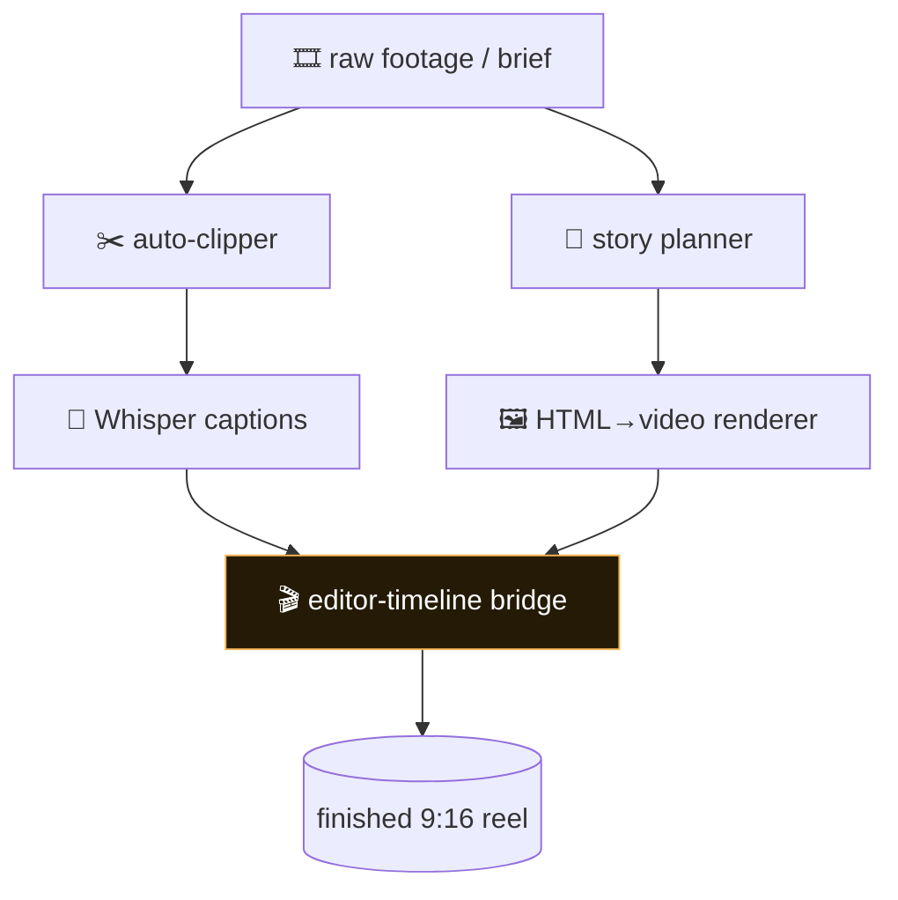
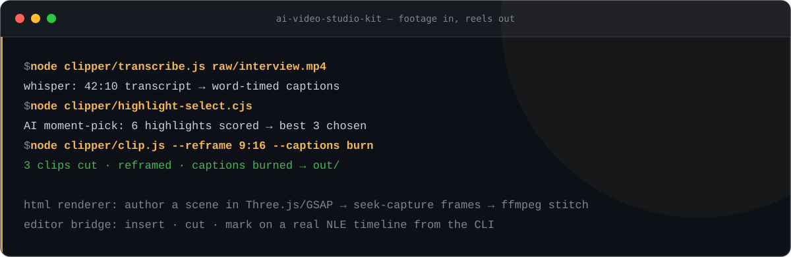

<!-- AI Video Studio Kit — white-label. No personal or company identifiers in this file by design. -->

<p align="center">
  
</p>

<h1 align="center">🎬 AI Video Studio Kit</h1>

<p align="center">
  <b>An AI-assisted studio for turning raw footage and ideas into finished short-form video.</b><br>
  <sub>A full open pipeline: auto-clip long video into 9:16 highlights, transcribe and caption with Whisper, script and storyboard, render motion graphics from HTML/JS, and cut on a real editor timeline — all with tools you host yourself.</sub>
</p>

<p align="center">

= 18">

</p>

<p align="center">
<code>auto-clipper</code> · <code>whisper-captions</code> · <code>html-to-video</code> · <code>9:16 reframe</code> · <code>montage</code> · <code>$0 core</code>
</p>

---

## Why AI Video Studio Kit

Short-form video production is a chain of specialized tools that rarely talk to each other. AI Video Studio Kit is that chain, open and self-hosted: an auto-clipper that finds the moments, a transcriber that captions them, a story planner that scripts them, an HTML-to-video renderer for motion graphics, and a bridge to a real NLE for the final cut. Bring ffmpeg and a browser; the kit does the rest.

---

## What it does

| Module | What it does | Signal |
|---|---|---|
| **clipper** | Whisper transcribe → AI moment-pick → 9:16 reframe → burned-in captions | runnable locally |
| **story planner** | Turn a brief into a shot list + narration script | structured plan |
| **html renderer** | Author a scene in HTML/JS (Three.js/GSAP), seek-capture each frame, stitch with ffmpeg | deterministic frames |
| **captions + VO** | Word-timed captions and voiceover spine from a transcript | per-word timing |
| **editor bridge** | Drive a real NLE timeline — insert clips, cut, mark, reframe — from the command line | live timeline |
| **craft docs** | Montage-craft, studio-process and editing playbooks baked in | know-how included |

---

## Architecture



---

## Quickstart

```bash
# 1. install (needs ffmpeg + a headless browser on PATH)
npm install

# 2. auto-clip a long video into captioned 9:16 highlights
node clipper/clip.js --help

# 3. render a motion-graphic scene from HTML to video
#    (author your scene, then capture + stitch)
cat pipeline/STUDIO.md
```

> The core clipper and HTML renderer are $0. Optional integrations (a cloud voice, a game-engine scene, a specific NLE) are documented as swappable add-ons — see `LICENSES.md` for third-party terms.

---

## See it run

<p align="center">
  
</p>

---

## Repository layout

```
reelforge/
├── clipper/        ← runnable: transcribe → moment-pick → 9:16 reframe → captions
├── pipeline/       ← studio process, montage craft, shot-list playbooks
├── assets/         ← CC0 reference assets + arsenal index
├── templates/      ← starting-point scene templates
├── LICENSES.md     ← third-party component terms (read before commercial use)
└── docs/           ← editing craft + studio router
```

---

## Concepts

| Concept | Meaning |
|---|---|
| **Clipper** | Whisper transcription → AI moment-pick → 9:16 reframe → burned-in captions: raw footage to short-form clips. |
| **Moment-pick** | Highlights are selected from the transcript by what was said, not just where the audio peaks. |
| **HTML renderer** | Author a scene in HTML/JS (Three.js, GSAP), seek-capture each frame headlessly, stitch with ffmpeg — motion graphics as code. |
| **Captions + VO spine** | Word-timed captions and a voiceover script derived from the same transcript, so audio and text never drift. |
| **Editor bridge** | Drive a real NLE timeline — insert clips, cut, mark, reframe — from the command line. |
| **Craft docs** | Montage-craft, studio-process, and editing playbooks ship in the repo — the taste layer, written down. |

---

## Design principles

1. **Open core.** The clipper and HTML→video renderer run with just ffmpeg and a browser — no paid service.
2. **Draft, then finish.** Render one still to look at before committing to a full-resolution pass.
3. **Respect third-party terms.** `LICENSES.md` flags any component (e.g. a non-commercial TTS model) that carries its own license.
4. **Repeatable edits.** Timeline actions are scripted, so a cut you make once you can make again.

---

<p align="center"><sub>AI Video Studio Kit · clip · caption · render · cut · MIT</sub></p>
