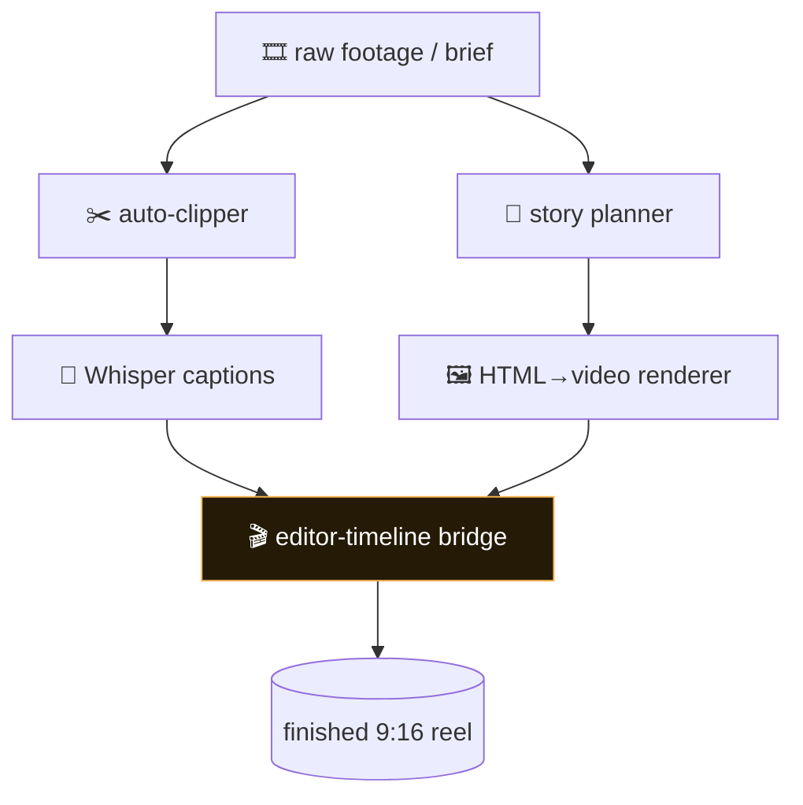

# AI Video Studio Kit — Architecture

A full open pipeline: auto-clip long video into 9:16 highlights, transcribe and caption with Whisper, script and storyboard, render motion graphics from HTML/JS, and cut on a real editor timeline — all with tools you host yourself.

## Flow

## How it fits together

AI Video Studio Kit is a set of stages you compose. The `clipper/` is the one runnable end-to-end today: it transcribes with Whisper, scores moments, reframes to 9:16, and burns captions. The `pipeline/` docs describe the fuller studio flow (plan → render → cut), and the HTML→video approach lets you build motion graphics with web tech and capture them deterministically. The editor bridge is optional and connects to a real NLE for the final assembly.

## Extending it

Every capability is a self-contained module. To add your own, follow the contract the existing
modules use and wire it into the entry point. Keep it portable — config via `.env`, no hardcoded
paths, no personal accounts.

## Design principles

1. **Open core.** The clipper and HTML→video renderer run with just ffmpeg and a browser — no paid service.
2. **Draft, then finish.** Render one still to look at before committing to a full-resolution pass.
3. **Respect third-party terms.** `LICENSES.md` flags any component (e.g. a non-commercial TTS model) that carries its own license.
4. **Repeatable edits.** Timeline actions are scripted, so a cut you make once you can make again.
